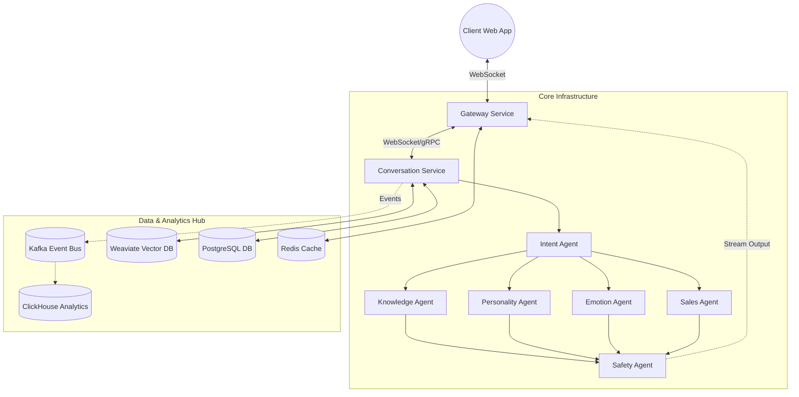

# Implemented Features

This document provides a quick overview of the currently implemented functions, services, and features in the AI Digital Human Platform repository. If you clone this repository, these are the components you can run and interact with right now.

## 1. Frontend User Interfaces (Static UI)
The platform includes vanilla HTML/JS files designed for performance and simple hosting (ready to be deployed to Vercel, Netlify, etc.):
- **`humana-landing.html`**: A conversion-optimized public-facing marketing page.
- **`humana-wizard.html`**: The onboarding configuration wizard where new businesses set up their digital avatar (prompt, knowledge base, voice).
- **`humana-dashboard.html`**: The real-time user dashboard showing avatar analytics, active sessions, and configuration settings for a given business.
- **`humana-admin.html`**: The platform-level administration panel for managing all multi-tenant businesses and platform-wide metrics.

## 2. Core Avatar Backend (`/app` and `/humana-backend`)
The primary FastAPI system powering the digital avatars is fully structured with the following AI features:
- **WebSocket Streaming**: Real-time WS connections (`/ws/avatar/{business_id}`) for live, low-latency interaction.
- **`brain_service.py`**: Handles LLM text generation and RAG orchestration using OpenAI/Claude.
- **`voice_service.py`**: Integrates Speech-to-Text (Whisper) for transcription and Text-to-Speech (ElevenLabs) for audio generation + viseme (lip-sync) extraction.
- **`emotion_service.py`**: Real-time emotion classification to adjust avatar tone and expressions.
- **`knowledge_service.py`**: Document ingestion and retrieval using a local ChromaDB database.

## 3. Analytics & Telemetry Engine
The backend event tracking system is designed to handle usage metrics and insights:
- **Event Ingestion**: `POST /api/v1/events` endpoint to record page views, CTA clicks, and interactions.
- **Real-Time Dashboard Streaming**: WebSocket endpoint (`ws://localhost:8001`) with Redis Pub/Sub to debounce and push aggregated metrics to the `humana-dashboard.html` every few seconds.
- **Database Schema**: SQLAlchemy models defining Businesses, Events, Insights, and DailyMetrics (currently using SQLite `humana.db`).
- **Background Tasks (Celery)**: Background worker tasks that process events offline and trigger LLM insight generation when anomalies (like performance drops) are detected.

## 4. V2 Microservices Scaffolding
The V2 Architecture (Blueprint 2.0) has been scaffolded to transition the monolith into scalable microservices:
- **`/gateway`**: The entry point API Gateway configured to terminal WebSockets and manage state/rate-limiting.
- **`/conversation-service`**: A dedicated FastAPI endpoint utilizing a LangGraph Agent Swarm (splitting tasks into Intent, Knowledge, Personality, Emotion, Sales, and Safety agents).
- **`docker-compose.yml`**: Designed to orchestrate the gateway, conversation-service, and necessary databases (like Redis/PostgreSQL).

## How to Check the State
If you clone this repository, you can verify the implementations by:
1. Running the Core Backend: `cd app && pip install -r requirements.txt && uvicorn main:app --reload --port 8000`
2. Serving the Frontend: Open a simple HTTP server in the root directory (`python3 -m http.server 3000`) and navigate to `http://localhost:3000/humana-landing.html`.
3. Validating the database (`humana.db`) or inspecting the container orchestration via `docker-compose up`.


# Complete System Report: AI Digital Human Platform

This document serves as your complete guide to the architecture, codebase, and deployment procedures for the **AI Digital Human Platform** project. If you were to clone this repository to a new machine, these instructions will allow you to run and understand all components perfectly.

---

## 1. System Architecture

The platform is divided into three major components:

1. **Frontend UIs (Static HTML/JS)**: A suite of HTML files that serve as the client interfaces. They connect to the backends via REST APIs and WebSockets.
2. **Humana Core Backend (`/app`)**: The primary FastAPI system that handles real-time WebSocket connections, RAG pipelines (ChromaDB), and interactions with AI models (OpenAI/Anthropic) and Voice/Lip-sync services (ElevenLabs).
3. **Infa Analytics Engine (`/infa-events`)**: A high-speed FastAPI microservice that ingests tracking events, streams them to the dashboard via WebSockets, and uses Celery background workers to generate AI-driven business insights.

---

## 2. Directory & File Breakdown

### Root-Level Frontend (UI Pages)
These are vanilla HTML/JS files designed for performance and simple hosting (e.g., Vercel, Netlify, Github Pages).
- `humana-landing.html`: The conversion-optimized public-facing marketing page.
- `humana-wizard.html`: The onboarding flow where new businesses configure their digital avatar (prompt, knowledge base, voice).
- `humana-dashboard.html`: The real-time user dashboard showing avatar analytics, active sessions, and configuration settings.
- `humana-admin.html`: The platform-level administration panel for managing all businesses and platform-wide metrics.

### Humana Core Backend (`/app`)
The main backend logic for the digital avatars.
- **`app/main.py`**: The FastAPI application entry point.
- **`app/routers/`**: Contains `api.py` (REST endpoints for configuration/knowledge) and `websocket.py` (the core real-time connection for avatar streaming).
- **`app/services/`**: The heavy lifting for AI processing.
  - `brain_service.py`: LLM text generation and RAG orchestration.
  - `voice_service.py`: Speech-to-Text (Whisper) and Text-to-Speech (ElevenLabs) + Viseme extraction.
  - `emotion_service.py`: Real-time emotion classification.
  - `knowledge_service.py`: Document ingestion into local ChromaDB.
- **`requirements.txt` / `Dockerfile`**: Deployment configurations for the core backend.

### Infa Analytics Engine (`/infa-events`)
The telemetry and reporting system.
- **`app/main.py`**: FastAPI server hosting `POST /api/v1/events` and `GET /ws/events/{business_id}`.
- **`app/models.py`**: SQLAlchemy database schema (Businesses, Events, Insights, DailyMetrics).
- **`app/worker.py`**: Celery worker tasks that process events offline and trigger OpenAI insight generation when performance drops are detected.
- **`app/core/redis.py`**: Redis client configurations for rate-limiting, IP blocking, and Pub/Sub WebSocket broadcasting.

---

## 3. How to Setup and Run Locally (As if cloned fresh)

### Pre-requisites
- **Python 3.9+** installed on your machine.
- **Redis Server** running locally (or using `fakeredis` for testing).
- API Keys: **OpenAI** (or Anthropic) and **ElevenLabs**.

### Step A: Start the Core Humana Backend
This backend powers the avatars on port `8000`.

```bash
# 1. Start in the root directory
cd "/Volumes/Volumn 1/Code Base/ShippingProducts/AI Digital Human Platform for Businesses"

# 2. Create and activate a Virtual Environment
python3 -m venv venv
source venv/bin/activate  # On Windows: venv\Scripts\activate

# 3. Install dependencies
pip install -r requirements.txt

# 4. Setup environment variables
cp .env.example .env
# --> Edit .env to add OPENAI_API_KEY and ELEVENLABS_API_KEY

# 5. Start the server
uvicorn app.main:app --reload --port 8000
```
- **Health Check:** `http://localhost:8000/docs`

### Step B: Start the Infa Analytics Engine
This backend tracks metrics on port `8001`.

```bash
# 1. Open a new terminal tab and navigate to the events engine
cd "/Volumes/Volumn 1/Code Base/ShippingProducts/AI Digital Human Platform for Businesses/infa-events"

# 2. Create another Virtual Environment
python3 -m venv venv
source venv/bin/activate 

# 3. Install dependencies
pip install -r requirements.txt
# If you don't have a local Redis server, you can fallback to fakeredis for dev:
pip install fakeredis

# 4. Initialize Database
# The app uses SQLite locally (humana.db). It will auto-create tables on startup.

# 5. Start the REST API
uvicorn app.main:app --reload --port 8001
```

### Step C: Start the Celery Worker (Analytics AI Generation)
The background worker requires Celery and Redis to process data without blocking the API.

```bash
# 1. Open a third terminal tab in the infa-events directory
cd "/Volumes/Volumn 1/Code Base/ShippingProducts/AI Digital Human Platform for Businesses/infa-events"
source venv/bin/activate

# 2. Start the Celery worker
celery -A app.worker.celery_app worker --loglevel=info
```

### Step D: Serve the Frontend
Because the frontend pages are static, you can use any HTTP server. Do **not** just double click them, as CORS errors may occur with the REST APIs.
```bash
# 1. In the root directory
python3 -m http.server 3000
```
- Open your browser to `http://localhost:3000/humana-landing.html`
- Make sure that inside the HTML/JS, the endpoints correctly reference `http://localhost:8000` for avatar features, and `http://localhost:8001` for analytics tracking.

## 4. How It Functions (Data Flow)

### A. The Core Avatar Loop
When a user visits a business's configured landing page:
1. **Connection**: The browser establishes a live WebSocket connection to the `humana-backend` (`ws://localhost:8000/ws/avatar/{business_id}`).
2. **Input**: The user speaks or types a question. If spoken, the audio is sent as base64 to the server.
3. **STT (Speech-to-Text)**: The `voice_service.py` uses OpenAI Whisper to transcribe the audio.
4. **RAG (Knowledge Retrieval)**: The `brain_service.py` queries ChromaDB to find relevant FAQ answers uploaded by the business.
5. **Generation**: An LLM (GPT-4o/Claude) formulates a persona-driven response.
6. **Emotion**: Simultaneously, the `emotion_service.py` determines the emotional valence/arousal of the text.
7. **TTS & Sync**: The `voice_service.py` calls ElevenLabs to generate audio and extracts visemes (lip sync signals).
8. **Output**: The server streams the text, emotion scores, visemes, and audio chunks back to the browser, which plays the audio and animates the 3D avatar.

### B. The Analytics Engine Loop
Tracking how users interact with the system:
1. **Tracking Script**: The frontend UI (or any configured website) runs a lightweight JavaScript tracker.
2. **Ingestion**: The script fires usage events (page views, CTA clicks, interactions) to the `infa-events` REST API (`POST :8001/api/v1/events`).
3. **Buffering**: The API quickly validates the event, stores it in an SQLite/PostgreSQL database, and pushes it to a Redis stream, immediately returning a 200 OK to the client.
4. **Live Dashboard**: The business owner looking at `humana-dashboard.html` receives live updates through the `infa-events` WebSocket connection (`ws://localhost:8001/ws/events/{business_id}`). A background task debounces these updates to ensure smooth chart rendering.
5. **Insight Generation**: A Celery background worker periodically checks for anomalies (e.g., massive drop in conversion rates). If detected, it queries the database, sends the data window to an LLM, and generates an actionable business "Insight" displayed on the dashboard.

---

## 5. Business Perspective & Enterprise Positioning

The AI Digital Human Platform represents a paradigm shift from traditional chatbots to **autonomous digital employees**. The platform is designed as an Enterprise SaaS solution (multitenant) and appeals to organizations looking to automate high-touch interactions.

### Core Use Cases

- **AI Sales Representatives:** Engages website visitors, analyzes intent (e.g., pricing questions vs. feature inquiries), identifies high-value leads, recommends products, and automatically pushes leads to CRMs or schedules demos.
- **Customer Support Agents:** Autonomously resolves tier-1 and tier-2 tickets in real-time by querying the RAG knowledge base.
- **Onboarding Assistants:** Guides new users through complex software interfaces.
- **Training Instructors:** Delivers interactive corporate training with a consistent, on-brand persona.

### Investment & Value Proposition

Investors in this category expect a full developer platform, not just an avatar. Key value drivers include:
1. **Agent Swarm Intelligence:** The avatar is just the interface; the real value is the background orchestration of multiple AI agents (Intent, Knowledge, Emotion, Sales, Safety).
2. **Enterprise Integrations:** Deep hooks into tools like Salesforce, HubSpot, and Slack.
3. **Multi-Tenant Architecture:** Isolated knowledge bases, analytics, and security policies per business.
4. **Data & Learning Loop:** Every interaction generates telemetry that feeds back into model fine-tuning and prompt optimization.

---

## 6. Humana V2 System Architecture (Blueprint 2.0)

Humana V2 transitions from a monolithic structure to a scalable, event-driven microservices architecture to support thousands of concurrent digital human conversations efficiently.

### Core Components

1. **Gateway Service (FastAPI / WebSockets)**
   - Acts as the entry point for all digital human interactions.
   - Terminates client WebSockets.
   - Manages connection state, heartbeats, and client identification.
   - Forwards conversational payloads down to the Conversation Service.

2. **Conversation Service (FastAPI / LangGraph)**
   - The core intelligence engine.
   - Implements an Agent Swarm using LangGraph.
   - Routes incoming messages via an `IntentAgent`.
   - Dispatches work to parallel specialized agents:
     - `KnowledgeAgent` (RAG / Weaviate integration)
     - `PersonalityAgent` (Brand alignment)
     - `EmotionAgent` (Avatar facial expression synchronization)
     - `SalesAgent` (Goal-oriented persuasion)
   - Channels all outputs through a final `SafetyAgent` before streaming back to the Gateway.

3. **Database Layer (V2 Analytics & Persistence)**
   - **PostgreSQL**: Replaces SQLite as the primary transactional database (Users, Profiles, Configuration).
   - **Kafka**: Acts as the central event bus for the system. Captures all conversation events, system logs, and metric emissions.
   - **ClickHouse**: Ingests high-throughput event data from Kafka for real-time dashboard reporting and analytics.
   - **Weaviate**: Enterprise vector database replacing ChromaDB for scalable, high-speed RAG operations.
   - **Redis**: Maintains ephemeral state (e.g., active WebSocket session mappings, rate limiting).

### Architecture Diagram



### Data Flow (Message Processing)

1. Client connects to **Gateway** via WebSocket.
2. User speaks/types -> Message is sent to **Gateway**.
3. **Gateway** validates session and forwards to **Conversation Service**.
4. **Conversation Service** processes the LangGraph pipeline:
   - `IntentAgent` determines the goal.
   - Specialized agents process the request in parallel.
   - `SafetyAgent` approves the final response.
5. Emitted conversation events (e.g., latency, topic, user sentiment) are asynchronously published to **Kafka**.
6. **ClickHouse** ingests these logs for real-time analytics.
7. Final safe response is streamed back through **Gateway** to the Client.

---

## 7. Production Deployment Next Steps

If moving from the local setup to this V2 Enterprise blueprint:

1. **Frontend & Edge:** Deploy the static UI assets to an Edge provider like Vercel or Cloudflare Pages.
2. **Core API (`app`) & Swarm:** Containerize the `gateway` and `conversation-service` via Docker. Deploy to a scalable orchestration service like Kubernetes or AWS ECS. Ensure WebSockets are supported by your load balancer for the gateway.
3. **Analytics Engine (`infa-events`):** Deploy as a separate microservice taking advantage of Kafka and ClickHouse.
4. **Databases:** Use managed instances for PostgreSQL (e.g. RDS), Redis (e.g. ElastiCache), MSK for Kafka, and managed ClickHouse and Weaviate clusters for stability.
5. **Worker Nodes:** Deploy the Celery workers independently so they can scale based on event load and background AI tasks.
6. **Security:** Implement Auth0 or an equivalent identity provider to secure access to the `humana-dashboard` and `humana-admin` interfaces. Ensure cross-origin resource sharing (CORS) strictly permits only authorized domains.

# Infa Analytics Engine Implementation Plan

## 1. Architecture Overview
Building a decoupled data ingestion and analytics system based on the `Infa.txt` specification. 
The system consists of two main services:
- ** existing `humana` backend:** Serves the AI avatar and main user dashboard. 
- ** new `infa-events` service:** A lightweight, high-throughput FastAPI service dedicated entirely to event ingestion (`POST /events`), aggregation, and WebSocket streaming.

## 2. Security & Rate Limiting (Public Script Protection)
For the public tracking script (`<script src="tracker.js">`):
1.  **CORS & Origin Validation:** The `POST /events` endpoint will strictly validate the `Origin` header against the registered website domain for that Business ID.
2.  **IP Rate Limiting:** We will use Redis to rate-limit incoming events by IP address (e.g., max 100 events per minute per IP) to prevent simple bot spam.
3.  **Payload Size Limits:** `FastAPI` will restrict the incoming JSON payload size to a maximum of 2KB per event.
4.  **Schema Validation:** Pydantic models will aggressively drop any payload with unexpected or deeply nested JSON fields to prevent NoSQL/JSON injection attacks.

## 3. Real-Time Streaming (Throttling)
To prevent overwhelming the browser with raw WebSocket pushes:
1.  **Redis Pub/Sub:** The ingestion API pushes events to a Redis channel (`events:{business_id}`).
2.  **Debounced WebSocket Broadcaster:** An asyncio task in the `infa-events` service listens to the Redis channel, aggregates metrics (e.g., user count, event sums) in memory, and pushes the aggregated snapshot to the WebSocket connection only once every **3 seconds**.

## 4. AI Insight Engine
- Insights will **only** be generated when the background Celery worker detects a predefined metric threshold violation (e.g., conversion rate drops by >15%). 
- It will pull a window of context metrics from PostgreSQL and make a targeted OpenAI API call.

## 5. Website Analyzer
- We will integrate with an external API (like Firecrawl, ScraperAPI, or Apify) to offload the headless browsing. The backend sends the URL, waits for the structured page report (CTAs, forms, etc.), and processes the results.

## Proposed Changes

### [NEW] `infa-events/requirements.txt`
FastAPI, Uvicorn, SQLAlchemy, psycopg2-binary, Redis, Celery.

### [NEW] `infa-events/app/main.py`
The lightweight event reception API.

### [NEW] `infa-events/app/models.py`
Database models (`Business`, `Event`, `DailyMetric`, `Insight`).

### [NEW] `infa-events/app/services/streaming.py`
The WebSocket debouncer pushing data to the dashboard.
# Humana V2 Architecture Implementation Plan

## Goal
To evolve the monolithic FastAPI system into a scalable, multi-tenant enterprise AI Digital Human Platform (as specified in `FixV2.txt`), starting with local development infrastructure.

## Phased Execution Strategy

### Phase 1: Infrastructure Scaffolding & Agent Swarm

#### 1. API Gateway & Docker Network
Set up a unified local cluster via `docker-compose.yml` to isolate domains:
- **API Gateway (`gateway`)**: A lightweight reverse proxy (e.g., Traefik or a dedicated FastAPI edge service) to route traffic between microservices and handle basic authentication/rate-limiting.
- **Conversation Service (`conversation-service`)**: A fast, asynchronous microservice dedicated strictly to hosting the Agent Swarm and processing real-time websocket I/O independent of administrative APIs.
- **Redis (`redis`)**: Brought in for semantic caching, robust Pub/Sub messaging for microservices, and background task queuing.

#### 2. Hybrid Agent Swarm (Intelligence Layer)
Migrate conversational intelligence out of the monolith into a dedicated asynchronous swarm. Leverage **LangGraph** (for reliable state passing, context memory, and directed agent routing) wrapped in **Custom Async Generators** (for high-speed, token-by-token media generation and websocket streaming).
- **Core Agents to scaffold**:
  - `IntentAgent`: Analyzes the user's textual/vocal intent and routes the query.
  - `KnowledgeAgent`: Handles retrieval-augmented generation (RAG) against company data.
  - `PersonalityAgent`: Injects dynamic brand voice adherence.
  - `EmotionAgent`: Adjusts tonal output and determines driving expressions for the avatar.
  - `SalesAgent`: Evaluates lead potential and pushes towards defined conversion outcomes (e.g., booking a demo).
  - `SafetyAgent`: Ensures safe and compliant outputs.

### Phase 2: Database & Analytics Upgrade

#### 1. Relational Database Migration
- Replace the lightweight SQLite storage with a production-ready **PostgreSQL** container in our `docker-compose.yml`.
- Update Alembic configurations and migrate existing dashboard/customer models.

#### 2. Scalable Event Streaming & Analytics 
- **Kafka / Redpanda**: Add to the compose stack to ingest conversation milestones, system events, and errors asynchronously without blocking the user interface.
- **ClickHouse**: Configure downstream from Kafka for ultra-low latency, complex statistical reporting on the Super Admin Dashboard.

#### 3. Enterprise Vector Database
- Transition away from local ChromaDB flat files to a scalable, dedicated Vector Database container (e.g., **Milvus** or **Weaviate**) to enable multi-tenant isolated search scopes.

---

## Technical Considerations
- **WebSocket Streaming**: Ensure the API Gateway preserves stateful, full-duplex WebSocket connections for real-time lip-sync and sub-second avatar latency.
- **Local Dev Loop**: Retain simplicity where one command (`docker compose up --build` or `docker compose watch`) spins up the entire V2 local testing cluster prior to real cloud deployments.

---

## 8. V3 Architecture Evolution & Production Hardening

This section documents the critical improvements identified for evolving the V2 blueprint into a genuinely production-grade AI platform, along with advanced capabilities and anti-patterns to avoid.

---

### 8.1 The Six Critical Infrastructure Fixes

#### Fix 1: Gateway WebSocket Bottleneck
**Problem:** A single gateway instance handling all WebSocket connections causes memory/CPU overload. At scale: 100 users → slow, 1,000 users → CPU spikes, 5,000 users → crash.

**Solution: Stateless, Horizontally Scalable Gateway**
- **Stateless Gateway:** Store all session state in Redis/NATS, not in gateway memory.
  ```
  Redis ws_sessions:
    user_id → gateway_instance_id
  ```
- **Kubernetes HPA:** Auto-scale gateway pods based on CPU utilization and WebSocket connection count (min 3 replicas → max 50).
- **WebSocket-aware Load Balancer:** Use NGINX, Envoy, or AWS ALB with proper WebSocket upgrade headers.

#### Fix 2: Voice Pipeline Latency
**Problem:** Sequential `STT → RAG → LLM → TTS` pipeline adds 3–7 seconds of latency — unacceptable for real-time avatars.

**Solution: Streaming AI Pipeline**
- Every stage streams its partial output to the next stage simultaneously.
- **STT Streaming:** Deepgram or AssemblyAI real-time transcription.
- **LLM Streaming:** `async for token in llm.stream(prompt): websocket.send(token)` — tokens sent as soon as generated.
- **TTS Streaming:** ElevenLabs or PlayHT streaming APIs convert LLM tokens to audio chunks on-the-fly.

**Result:** Latency drops from **3–7 seconds → 300–800ms**.

#### Fix 3: RAG Multi-Tenant Scaling
**Problem:** 1,000 companies × 10,000 docs each = 10 million vectors. A single flat vector space makes search slow.

**Solution: Namespace Isolation with Weaviate Multi-Tenancy**
```json
{
  "class": "BusinessKnowledge",
  "vectorIndexType": "hnsw",
  "multiTenancyConfig": { "enabled": true }
}
```
Each query is scoped to a single tenant's 10k vectors instead of searching across 10M. This delivers a dramatic performance improvement.

#### Fix 4: Multi-Modal Emotion Detection
**Problem:** Text-only emotion detection is weak — "yeah great thanks" can be sarcasm or genuine enthusiasm.

**Solution:** Combine three independent signal sources with a weighted average:
```
emotion = weighted_average(voice_tone, text_sentiment, conversation_history)
```
- **Voice emotion:** `wav2vec` or `SpeechBrain` emotion models.
- **Text sentiment:** RoBERTa or OpenAI sentiment classification.
- **Context model:** Tracks emotional trajectory across the conversation.

#### Fix 5: Insight Engine Cost Control
**Problem:** Running LLM insights for every event across 100k businesses causes cost explosion.

**Solution: ML Anomaly Detection Filter**
Only send events to the LLM when the anomaly detector flags something unusual:
```python
from sklearn.ensemble import IsolationForest
model = IsolationForest()
model.fit(metrics_data)
anomaly = model.predict(new_data)
# Only anomalies trigger LLM call
```
**Result:** LLM usage reduced from 100% of events → ~2% of events. Massive cost savings. This is already partially implemented in `infa-events/app/worker.py` and should be extended.

#### Fix 6: Conversation Memory Layer
**Problem:** The current system uses RAG + a single prompt context. Agents have no persistent memory across sessions.

**Solution: Three-Tier Memory Architecture**

| Layer | Storage | Content | TTL |
|---|---|---|---|
| Short-term | Redis | Last 20 messages, active session state | 30 min |
| Long-term | PostgreSQL | User preferences, lead history, booked demos | Permanent |
| Semantic | Weaviate | Past conversation summaries (vector-searchable) | Permanent |

---

### 8.2 Advanced AI Capabilities (V3+ Roadmap)

#### Autonomous Agent Planning
Instead of simple question-answer patterns, the system plans and executes multi-step strategies:
```json
{
  "goal": "convert_lead",
  "steps": ["understand_needs", "recommend_product", "ask_budget", "offer_demo"]
}
```
Use LangGraph's graph execution to run through steps sequentially, with each agent handling one node in the plan.

#### Real-Time Behavior Optimization
The system continuously monitors user signals and adapts its strategy:

| Signal Detected | Strategy Change |
|---|---|
| Frustration | Simplify explanation |
| High buying intent | Push demo booking |
| Confusion | Offer visual example |
| Disengagement | Increase energy/persona |

Tracked metrics: response latency, message length, tone, emotion score, conversion events.

#### AI Sales Persuasion Models
A lead scoring model predicts conversion probability and drives strategy selection:
```
lead_score < 0.3   → educate and build trust
lead_score 0.3–0.6 → provide product comparison
lead_score > 0.6   → aggressively push demo booking
```
Train on past conversations, conversion outcomes, and sales funnel metrics using XGBoost or logistic regression.

#### Self-Improving Conversation Loops
The system evolves its own prompts through A/B testing and reinforcement learning:
- **Reward signals:** `demo_booked + purchase_completed + positive_feedback`
- **A/B Testing:** Variant A vs. Variant B response strategies, keeping the better performer.
- **Continuous loop:** Conversations → Analytics → Performance Evaluation → Prompt Optimization → Model Update.

---

### 8.3 Agent Swarm Architecture Deep Dive

The six core agents and their responsibilities:

| Agent | Role | Key Action |
|---|---|---|
| **IntentAgent** | Goal classification | Routes query to correct swarm agents |
| **PlannerAgent** | Strategy generation | Produces step-by-step task graph |
| **KnowledgeAgent** | RAG retrieval | Searches Weaviate for relevant documents |
| **EmotionAgent** | Signal fusion | Fuses voice, text, history into emotion score |
| **SalesAgent** | Conversion optimization | Applies lead scoring + persuasion strategy |
| **SafetyAgent** | Final gate | Rejects harmful, hallucinated, or off-policy outputs |

**Parallel execution pattern:** All specialized agents (Knowledge, Emotion, Sales) run simultaneously after IntentAgent classification, then their outputs merge and flow through SafetyAgent before returning to the user.

**Guardrails to prevent swarm explosion:**
```python
max_agents = 5
max_task_depth = 3
execution_timeout = 30  # seconds
```

**Communication format** between agents:
```json
{
  "agent": "knowledge_agent",
  "task": "retrieve_docs",
  "query": "pricing plans",
  "tenant_id": "business_123"
}
```

---

### 8.4 The Full Production Architecture Stack

When all layers combine, the complete architecture is:

```
Users
 ↓
CDN / Cloudflare Edge
 ↓
Global Load Balancer (NGINX / AWS ALB)
 ↓
WebSocket Gateway Cluster (Stateless, HPA-scaled)
 ↓
Conversation Service (FastAPI / LangGraph)
 ↓
Agent Swarm Runtime
 ├── Intent Agent
 ├── Planner Agent
 ├── Knowledge Agent (Weaviate Multi-Tenant RAG)
 ├── Emotion Agent (Multi-Modal Fusion)
 ├── Sales Agent (Lead Scoring Model)
 └── Safety Agent (Policy Engine)
 ↓
Behavior Optimization Engine
 ↓
Model Router (Small LLM / Large LLM / Speech Model)
 ↓
Streaming Inference (vLLM / ElevenLabs / Deepgram)
 ↓
Three-Tier Memory (Redis / PostgreSQL / Weaviate)
 ↓
Kafka Event Bus
 ├── ClickHouse Analytics
 ├── Safety Monitoring Service
 ├── Anomaly Detection (IsolationForest → LLM Insight)
 └── Learning / Prompt Optimization System
```

**Architecture rating after V3 fixes: 9 / 10** — this becomes very close to production-grade AI infrastructure.

---

### 8.5 Solo-Developer Practical Path

For the current phase, the enterprise hyperscale stack is not required. Run on 3–4 servers:

| Server | Services |
|---|---|
| Server 1 | NGINX + FastAPI (Humana backend + Infa-Events) |
| Server 2 | Redis + PostgreSQL |
| Server 3 | Weaviate (Vector DB) |
| External | AI models (OpenAI, ElevenLabs, Deepgram APIs) |

**Realistic capacity:** 10k–100k concurrent users before major scaling changes are needed.

**Cheap deployment stack:**
- Frontend → **Vercel** (free tier)
- Backend → **DigitalOcean Droplet** or **Railway**
- Database → **Supabase** (managed PostgreSQL + Vector)
- AI models → **OpenAI / Anthropic / ElevenLabs APIs**

**Total cost:** < $100/month to start.

**Strategic focus for the next phase:**
1. Agent orchestration + streaming pipeline performance
2. Memory layer (Redis short-term + PostgreSQL long-term)
3. Basic lead scoring model
4. Analytics feedback loop

---

### 8.6 Critical Scaling Anti-Patterns to Avoid

These 10 mistakes cause most AI SaaS failures:

| # | Anti-Pattern | Symptom | Fix |
|---|---|---|---|
| 1 | **Synchronous AI calls** | 100 users → 100 blocked threads | Move AI tasks to Celery/RQ background workers |
| 2 | **No rate limiting** | Single user or bot destroys your bill | 20 req/min/user via Redis token buckets |
| 3 | **Agent swarm explosion** | 1 request → 50 recursive agent tasks | `max_task_depth=3`, `timeout=30s` |
| 4 | **Context explosion** | 50k token prompts → slow + expensive | Context compression: summarization + semantic pruning |
| 5 | **Database bottlenecks** | 1000 writes/sec → DB locks | Separate: PostgreSQL (transactional) + Redis (cache) + ClickHouse (analytics) |
| 6 | **No AI result caching** | Same question → new LLM call every time | Redis cache: check cache before calling AI |
| 7 | **Logging overload** | Gigabytes of logs slow the system | Log at INFO/ERROR levels only; use Sentry for errors |
| 8 | **WebSocket flooding** | Thousands of open connections | Connection limits, heartbeat timeouts, NGINX pooling |
| 9 | **Model latency cascades** | 4 sequential AI calls × 5s = 20s response | Parallelize: Intent + Knowledge + Emotion run simultaneously |
| 10 | **No cost guardrails** | 100 users × 30k tokens/request = bankruptcy | Daily token limits, usage quotas, Stripe usage-based billing |

**Root causes behind all 10 failures:**
- Uncontrolled AI calls
- Unbounded agent loops
- Unoptimized infrastructure

Fix these early, and the system becomes 10× more stable.

---

### 8.7 Strategic Product Direction

Based on the current architecture components (AI avatar interface + agent swarm + analytics dashboards + business configuration), the strongest commercial path is:

> **AI Sales + Analytics Workforce Platform**

This means:
- AI talks to customers (avatar interface → lead conversion)
- AI analyzes business metrics (Infa analytics → anomaly detection → insight generation)
- AI recommends actions (LLM insight engine → actionable recommendations)

**Immediate commercial target:**
- **Product:** AI Sales Agent for Websites + AI Executive Dashboard
- **Pricing:** $79–$299/month per business
- **Target customers:** SaaS companies with active sales funnels

**A $10k/month SaaS requires only 100 customers at $100/month.** Ship a focused product first, then expand into the full autonomous AI workforce platform.


# HUMANA — FastAPI WebSocket Backend

> AI Digital Human Platform — Server Component

---

## Architecture

```
Browser / Mobile App
      ↓ WebSocket (ws://server/ws/avatar/{business_id})
WebSocket Gateway        ← app/routers/websocket.py
      ↓
  ┌───┴────────────────────────────────────┐
  │ AI Brain Pipeline                       │
  │  1. RAG retrieval  (ChromaDB)           │
  │  2. LLM generation (OpenAI / Anthropic) │
  │  3. Emotion classify (GPT-4o-mini)      │
  └───────────────┬────────────────────────┘
                  ↓
  ┌───────────────┴────────────────────────┐
  │ Voice Pipeline                          │
  │  4. STT: Whisper (if audio input)       │
  │  5. TTS: ElevenLabs                     │
  │  6. Viseme extraction                   │
  └─────────────────────────────────────────┘
      ↓
Client receives:
  • avatar_response  (text + emotion)
  • viseme frames    (lip sync signals)
  • audio_chunk      (base64 MP3)
```

---

## Quick Start

### 1. Clone and configure

```bash
cp .env.example .env
# Edit .env with your API keys
```

### 2. Install dependencies

```bash
python -m venv venv
source venv/bin/activate      # Windows: venv\Scripts\activate
pip install -r requirements.txt
```

### 3. Run locally

```bash
uvicorn app.main:app --reload --port 8000
```

API docs: http://localhost:8000/docs
Health:   http://localhost:8000/api/health

### 4. Run tests

```bash
pip install pytest pytest-asyncio
pytest tests/ -v
```

---

## WebSocket Protocol

### Connect

```
ws://localhost:8000/ws/avatar/{your-business-id}
```

### Client → Server messages

```json
// Send a text message
{ "type": "user_text", "text": "What are your hours?", "session_id": "..." }

// Send audio (base64 encoded)
{ "type": "user_audio", "audio_b64": "...", "sample_rate": 16000, "session_id": "..." }

// Heartbeat
{ "type": "ping", "session_id": "..." }

// Request human handoff
{ "type": "handoff_request", "session_id": "..." }
```

### Server → Client messages

```json
// On connect
{
  "type": "session_start",
  "session_id": "uuid",
  "avatar_name": "Alex",
  "welcome_message": "Hi! How can I help?",
  "emotion": { "valence": 0.6, "arousal": 0.3 }
}

// AI response (drives text + facial expression)
{
  "type": "avatar_response",
  "text": "We're open Monday to Friday, 9am to 5pm.",
  "emotion": { "valence": 0.5, "arousal": 0.2 },
  "is_speaking": true,
  "confidence": 0.87,
  "source": "knowledge_base"
}

// Lip sync signal — sent BEFORE audio
{
  "type": "viseme",
  "viseme": "AA",
  "time_offset_ms": 240,
  "duration_ms": 80
}

// TTS audio
{
  "type": "audio_chunk",
  "audio_b64": "...",
  "chunk_index": 0,
  "is_final": true
}
```

---

## REST API

### Upload knowledge (text)
```
POST /api/business/{id}/knowledge/text
{ "text": "FAQ content...", "source_name": "website_faq" }
```

### Upload knowledge (file: PDF, TXT, DOCX, MD)
```
POST /api/business/{id}/knowledge/file
Content-Type: multipart/form-data
file: <your-document>
```

### Update avatar config
```
PUT /api/business/{id}/config
{
  "avatar_name": "Sara",
  "business_name": "Coastal Clinic",
  "personality": "Warm and professional",
  "role_description": "Help patients book appointments and answer FAQs",
  "welcome_message": "Hi! I'm Sara, your virtual receptionist. How can I help?"
}
```

---

## Deploy to Railway (recommended for solo dev)

```bash
# Install Railway CLI
npm install -g @railway/cli

# Login and deploy
railway login
railway init
railway up
```

Set environment variables in Railway dashboard from `.env.example`.

---

## Tech Stack

| Layer | Tool | Why |
|---|---|---|
| API framework | FastAPI | Async, WebSocket native, auto docs |
| WebSocket | Starlette (built-in) | Zero extra deps |
| LLM | OpenAI GPT-4o / Claude | Switchable via config |
| STT | OpenAI Whisper | Best accuracy |
| TTS | ElevenLabs Turbo v2 | Lowest latency natural voice |
| RAG | LlamaIndex + ChromaDB | Simple, local, persistent |
| Auth | python-jose + passlib | Lightweight JWT |
| Database | Supabase | Auth + storage + Postgres |
| Logging | structlog | Structured JSON logs |

---

## File Structure

```
humana-backend/
├── app/
│   ├── main.py                  # App factory, lifespan, CORS
│   ├── core/
│   │   ├── config.py            # Settings from .env
│   │   └── session_manager.py   # Live WebSocket session registry
│   ├── models/
│   │   └── messages.py          # All WebSocket message schemas
│   ├── routers/
│   │   ├── websocket.py         # Main WS endpoint + message routing
│   │   └── api.py               # REST endpoints (upload, config, health)
│   └── services/
│       ├── brain_service.py     # LLM + RAG pipeline
│       ├── knowledge_service.py # ChromaDB ingest + retrieval
│       ├── voice_service.py     # Whisper STT + ElevenLabs TTS + visemes
│       └── emotion_service.py   # Valence/arousal classifier
├── tests/
│   └── test_pipeline.py        # Unit tests (no API keys needed)
├── requirements.txt
├── Dockerfile
└── .env.example
```

---

## Additional Platform Components

### Frontend UI / Dashboards
- `humana-landing.html`: A modern, conversion-optimized landing page for the AI Digital Human Platform.
- `humana-dashboard.html`: A comprehensive admin portal for managing AI avatars, uploading knowledge base documents, and viewing analytics.

### Infa Analytics Event Engine (`/infa-events`)
A dedicated high-throughput microservice for tracking, streaming, and analyzing platform usage.

* **FastAPI Core**: Handles incoming tracking events with built-in rate limiting and validation (`/api/v1/events`).
* **Redis Streams**: Decouples API ingestion from database writes for maximum throughput and reliability.
* **WebSocket Steaming**: Real-time event broadcasting to the dashboard for live monitoring (`/ws/events/{business_id}`).
* **Celery + OpenAI**: Asynchronous background workers process events, store them in PostgreSQL, and utilize OpenAI to generate daily trend insights and detect anomalies.
* **Database Schema**: Robust SQLAlchemy tracking for Businesses, raw Events, Daily Metrics, and AI-generated Insights.
* **Automated Tests**: Includes a fully functional `pytest` suite for the API endpoints to guarantee reliability.

#### Running the Infa Events Engine:
```bash
cd infa-events
python -m venv venv
source venv/bin/activate
pip install -r requirements.txt

# Ensure Redis and PostgreSQL are running, configure .env, then start:
uvicorn app.main:app --reload --port 8001
```

# Start Celery Worker (In a separate terminal)
```bash
cd infa-events
source venv/bin/activate
celery -A app.worker.celery_app worker --loglevel=info
```
# Infa Analytics Engine Implementation Plan

## 1. Architecture Overview
Building a decoupled data ingestion and analytics system based on the `Infa.txt` specification. 
The system consists of two main services:
- ** existing `humana` backend:** Serves the AI avatar and main user dashboard. 
- ** new `infa-events` service:** A lightweight, high-throughput FastAPI service dedicated entirely to event ingestion (`POST /events`), aggregation, and WebSocket streaming.

## 2. Security & Rate Limiting (Public Script Protection)
For the public tracking script (`<script src="tracker.js">`):
1.  **CORS & Origin Validation:** The `POST /events` endpoint will strictly validate the `Origin` header against the registered website domain for that Business ID.
2.  **IP Rate Limiting:** We will use Redis to rate-limit incoming events by IP address (e.g., max 100 events per minute per IP) to prevent simple bot spam.
3.  **Payload Size Limits:** `FastAPI` will restrict the incoming JSON payload size to a maximum of 2KB per event.
4.  **Schema Validation:** Pydantic models will aggressively drop any payload with unexpected or deeply nested JSON fields to prevent NoSQL/JSON injection attacks.

## 3. Real-Time Streaming (Throttling)
To prevent overwhelming the browser with raw WebSocket pushes:
1.  **Redis Pub/Sub:** The ingestion API pushes events to a Redis channel (`events:{business_id}`).
2.  **Debounced WebSocket Broadcaster:** An asyncio task in the `infa-events` service listens to the Redis channel, aggregates metrics (e.g., user count, event sums) in memory, and pushes the aggregated snapshot to the WebSocket connection only once every **3 seconds**.

## 4. AI Insight Engine
- Insights will **only** be generated when the background Celery worker detects a predefined metric threshold violation (e.g., conversion rate drops by >15%). 
- It will pull a window of context metrics from PostgreSQL and make a targeted OpenAI API call.

## 5. Website Analyzer
- We will integrate with an external API (like Firecrawl, ScraperAPI, or Apify) to offload the headless browsing. The backend sends the URL, waits for the structured page report (CTAs, forms, etc.), and processes the results.

## Proposed Changes

### [NEW] `infa-events/requirements.txt`
FastAPI, Uvicorn, SQLAlchemy, psycopg2-binary, Redis, Celery.

### [NEW] `infa-events/app/main.py`
The lightweight event reception API.

### [NEW] `infa-events/app/models.py`
Database models (`Business`, `Event`, `DailyMetric`, `Insight`).

### [NEW] `infa-events/app/services/streaming.py`
The WebSocket debouncer pushing data to the dashboard.
# Humana V2 Architecture Implementation Plan

## Goal
To evolve the monolithic FastAPI system into a scalable, multi-tenant enterprise AI Digital Human Platform (as specified in `FixV2.txt`), starting with local development infrastructure.

## Phased Execution Strategy

### Phase 1: Infrastructure Scaffolding & Agent Swarm

#### 1. API Gateway & Docker Network
Set up a unified local cluster via `docker-compose.yml` to isolate domains:
- **API Gateway (`gateway`)**: A lightweight reverse proxy (e.g., Traefik or a dedicated FastAPI edge service) to route traffic between microservices and handle basic authentication/rate-limiting.
- **Conversation Service (`conversation-service`)**: A fast, asynchronous microservice dedicated strictly to hosting the Agent Swarm and processing real-time websocket I/O independent of administrative APIs.
- **Redis (`redis`)**: Brought in for semantic caching, robust Pub/Sub messaging for microservices, and background task queuing.

#### 2. Hybrid Agent Swarm (Intelligence Layer)
Migrate conversational intelligence out of the monolith into a dedicated asynchronous swarm. Leverage **LangGraph** (for reliable state passing, context memory, and directed agent routing) wrapped in **Custom Async Generators** (for high-speed, token-by-token media generation and websocket streaming).
- **Core Agents to scaffold**:
  - `IntentAgent`: Analyzes the user's textual/vocal intent and routes the query.
  - `KnowledgeAgent`: Handles retrieval-augmented generation (RAG) against company data.
  - `PersonalityAgent`: Injects dynamic brand voice adherence.
  - `EmotionAgent`: Adjusts tonal output and determines driving expressions for the avatar.
  - `SalesAgent`: Evaluates lead potential and pushes towards defined conversion outcomes (e.g., booking a demo).
  - `SafetyAgent`: Ensures safe and compliant outputs.

### Phase 2: Database & Analytics Upgrade

#### 1. Relational Database Migration
- Replace the lightweight SQLite storage with a production-ready **PostgreSQL** container in our `docker-compose.yml`.
- Update Alembic configurations and migrate existing dashboard/customer models.

#### 2. Scalable Event Streaming & Analytics 
- **Kafka / Redpanda**: Add to the compose stack to ingest conversation milestones, system events, and errors asynchronously without blocking the user interface.
- **ClickHouse**: Configure downstream from Kafka for ultra-low latency, complex statistical reporting on the Super Admin Dashboard.

#### 3. Enterprise Vector Database
- Transition away from local ChromaDB flat files to a scalable, dedicated Vector Database container (e.g., **Milvus** or **Weaviate**) to enable multi-tenant isolated search scopes.

---

## Technical Considerations
- **WebSocket Streaming**: Ensure the API Gateway preserves stateful, full-duplex WebSocket connections for real-time lip-sync and sub-second avatar latency.
- **Local Dev Loop**: Retain simplicity where one command (`docker compose up --build` or `docker compose watch`) spins up the entire V2 local testing cluster prior to real cloud deployments.
